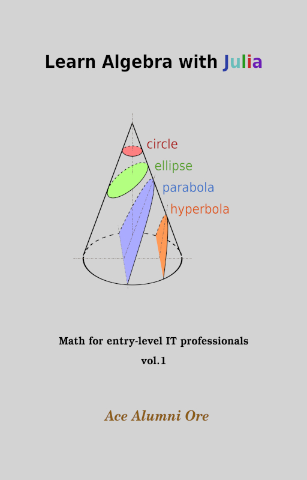
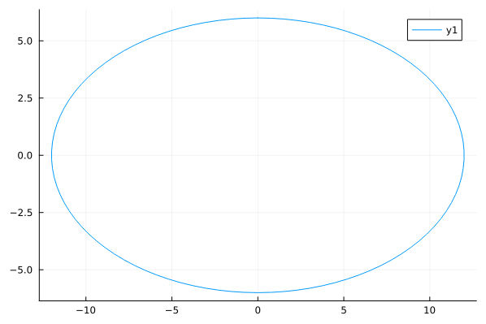
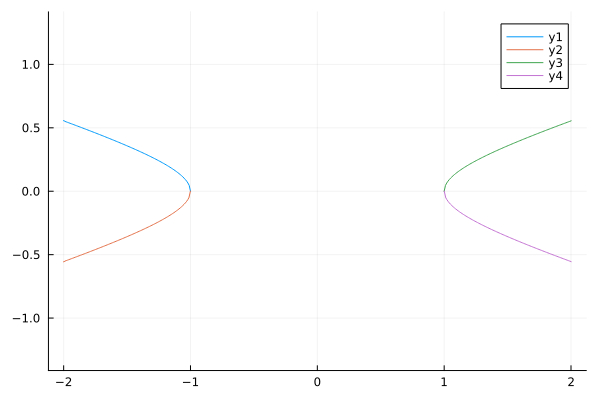
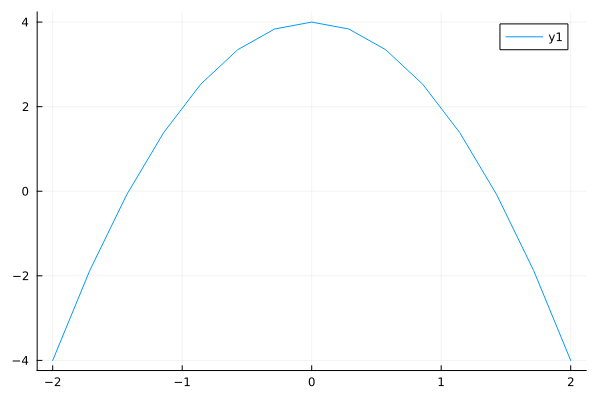

# book-math_with_julia-vol.1
Learn Algebra with Julia - Math for entry-level IT professionals, Vol. 1

## book cover

## some plots

## get the book
The ebook now fully revised is available at [this address]().

## table of contents
<h4>Contents</h4>

rights

Intro

1.. Algebra

1.1. Arithmetic operations

1.2. Inequalities

1.3. Absolute Value

1.6. Radicals

1.7. Complex Numbers

1.8. Logarithms

1.9. Factoring

1.10. Square Root Property

1.11. Quadratic

1.12. Absolute Value Inequalities

1.13. Solving quadratic equations - other ways

1.14. Functions and Graphs

1.14. Functions and Graphs (cont.)

1.15. Functions and Graphs (cont. 2)

# License
Copyright [2022] [J. Manuel Caeiro D. P.]

 This work is licensed under a <a rel="license" href="http://creativecommons.org/licenses/by-nc-nd/4.0/">Creative Commons Attribution-NonCommercial-NoDerivatives 4.0 International License</a>.
